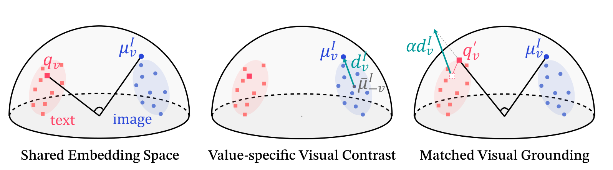
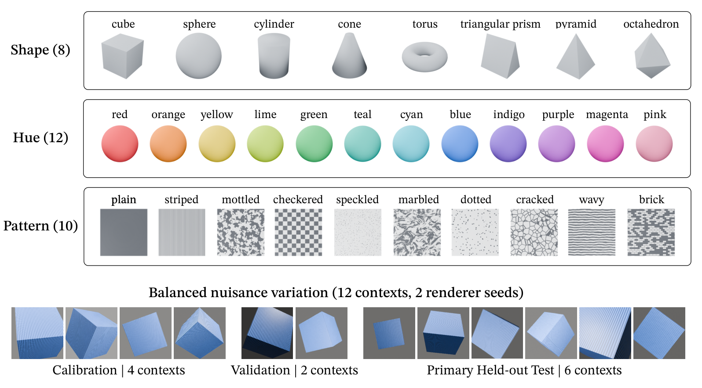

<h1 align="center">Seeing Is Not Addressing:<br>Auditing Linguistic Access to Frozen Visual Geometry</h1>

<p align="center">
  <b>Woosang Jeon<sup>1,*</sup> · Jiwon Yang<sup>1,*</sup> · Soo Chung<sup>1</sup> · Taehyeong Kim<sup>1,†</sup></b><br><br>
  <sup>1</sup>Seoul National University<br>
  <sup>*</sup>Equal contribution &nbsp; <sup>†</sup>Corresponding author
</p>

<p align="center">
  <a href="https://huggingface.co/datasets/6uvsoomJ/FactorAtlas"></a>
  <a href="#reproduce-the-core-audit"></a>
  
  <a href="LICENSE"></a>
</p>

> **A visual distinction can be present in frozen image geometry, yet remain
> inaccessible through its native text query.** We separate these two failures,
> then test whether the relevant visual contrast can restore held-out access.



For a value \(v\), we estimate a visual target-versus-rest direction from
calibration images and use it to ground only its native query:

$$
\mu_v = \mathrm{norm}\left(\frac{1}{|C_v|}\sum_{x\in C_v}\mathrm{norm}(I(x))\right),\qquad
d_v = \mathrm{norm}\left(\mu_v - \frac{1}{|V|-1}\sum_{u\ne v}\mu_u\right),\qquad
q'_v(\alpha) = \mathrm{norm}(q_v + \alpha d_v).
$$


## FactorAtlas

FactorAtlas is a controlled synthetic benchmark with 8 shapes, 12 hues, 10
patterns, 12 rendering contexts, and 2 deterministic replicas per cell:
23,040 images in total. It keeps the semantic factors fully crossed while
varying camera, pose, illumination, material, and background.



The complete images and metadata are hosted separately. This repository contains
only the minimal reference implementation; it does not bundle model weights.
For an independent Blender reimplementation, see the [renderer specification](docs/RENDERER_SPEC.md).
The [core pipeline](docs/CORE_PIPELINE.md) explains the held-out audit and controls.

---
## Reproduce the core audit

```bash
pip install -r requirements.txt
bash scripts/run_factoratlas.sh
```

The command downloads FactorAtlas into `data/factoratlas`, downloads the default
SigLIP2 Base model, caches its embeddings, and writes the final report to
`data/factoratlas/results/siglip2_base.json`.

Use a different frozen Hugging Face model or CPU when needed:

```bash
bash scripts/run_factoratlas.sh --model <model-id> --tag <name> --device cpu
```

## Citation

Citation metadata is provided in [CITATION.cff](CITATION.cff). A preprint link
will be added when available.
